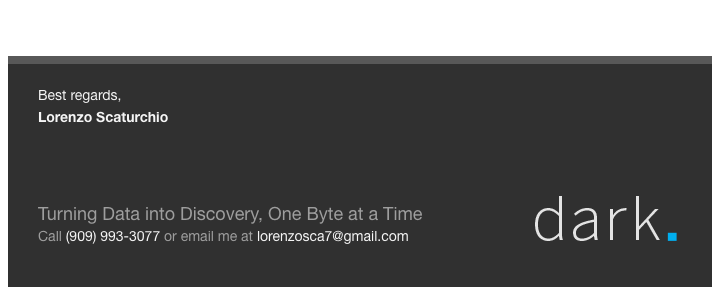
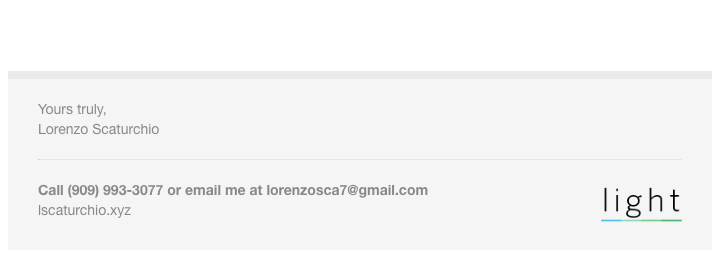

# email-signature

My responsive HTML email signatures, and the generator that builds them.

Built on [responsive-html-email-signature](https://github.com/danmindru/responsive-html-email-signature)
by Dan Mindru (MIT). The build pipeline is his; the content is mine.

<p align="center">
  
</p>
<p align="center">
  
</p>

## What is in here

- `templates/dark/` and `templates/light/` — two themes. Each has a `conf.json`
  with my name, contact details, slogan and site, the HTML partials, a CSS
  file, and the logo PNG under `assets/`.
- `tasks/`, `gulpfile.js` — the gulp pipeline from upstream: preprocess the
  HTML includes, compile the CSS, inline it into the markup, base64 the logo,
  minify. The output is a single self-contained `.html` per signature that
  pastes into any mail client.
- `tests/` — snapshot tests. `tests/sample/` is the expected output for the
  current `conf.json`s; `npm test` rebuilds and diffs against it.

## Build

Node 22 (see `.nvmrc`), npm.

```sh
npm ci
npm run once      # one build -> dist/
npm start         # build and watch templates/
npm test          # build and diff against tests/sample
```

`dist/dark/signature-dark.html` and `dist/light/signature-light.html` are the
files to paste into a mail client. `signature-reply-*.html` are shorter
variants for replies; `full-mail-light.html` is a whole email body.

To change the text, edit `templates/<theme>/conf.json`, run `npm run once`,
then `cp -r dist/* tests/sample/` to update the snapshots.

## What I changed vs upstream

- Filled in both `conf.json`s with my details and removed the placeholder
  Danish address/phone.
- Renamed the package and dropped upstream's npm-publish, gh-pages deploy,
  S3 upload workflow and the OIDC/CloudFormation scripts under `cicd/`.
- Removed the translated READMEs, demo site and `CNAME`.
- One small CI workflow that installs, builds and runs the snapshot tests.
- Refreshed the snapshots to match my content.

The logo images (`dark.png` / `light.png`) are still upstream's placeholders.

## Credit

The generator, templates, gulp tasks and tests come from
[danmindru/responsive-html-email-signature](https://github.com/danmindru/responsive-html-email-signature),
MIT-licensed, copyright 2016 fadeit ApS. See [LICENSE](LICENSE).
